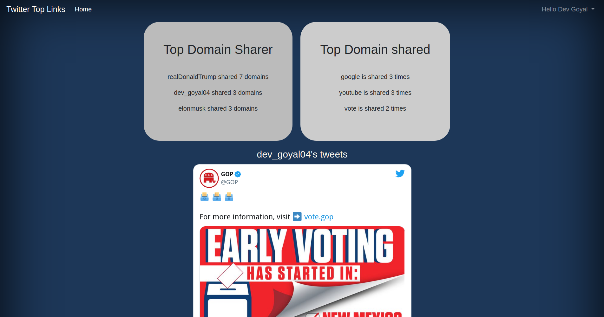

# Twitter-Top-Links
This application is built on Python Django framework.
The application has following functionalities:
1. Lets the user sign in through twitter.
2. Fetches the tweets that contains URL's from the user's stream (friends + users post) for the past 7 days.
3. Fetches the top 3 user which has shared maximum number of links.
4. Fetches the top 3 domains that have been shared so far.

* **The Project is hosted on pythonanywhere at** [devgoyal04.pythonanywhere.com](https://devgoyal04.pythonanywhere.com)

## Getting Started
1. Clone the repository using ```git clone```
```bash
https://github.com/devgoyal04/Twitter-Top-Links.git
```
2. ```cd``` into the project directory and run
```bash
pip install -r requirements.txt
```
3. **Migrate** the tables to the database using
```bash
python manage.py makemigrations
python manage.py migrate
```

## Prerequisites
1. [pip](https://pip.pypa.io/en/stable/) and python3.8 should be installed on your environment.
2. Consumer keys from Twitter Developer 

## Installation
### pip
```bash
sudo apt install python-pip
```
verify the installation by
```bash
pip --version
```

## Running the Server
1. Create a config.py file in **topLinks** folder.

2. Generate **CONSUMER_KEY** and **CONSUMER_KEY** from Twitter Developer console [developer.twitter.com/en/portal/projects-and-apps](https://developer.twitter.com/en/portal/projects-and-apps) and paste them in the **config.py** file along with the **SECRET_KEY**.
 
3. Open terminal and run.
```bash
python manage.py runserver
```
The local server will be up, browse to [localhost:8000](http://localhost:8000) to see the app running

## Tech Stack
* [Django](https://www.djangoproject.com/) - Python framework
* [SQLite3](https://www.sqlite.org/index.html)
* HTML, CSS, Bootsrap
* Tweepy API


## Screenshots
- Landing page 


- Home page 


